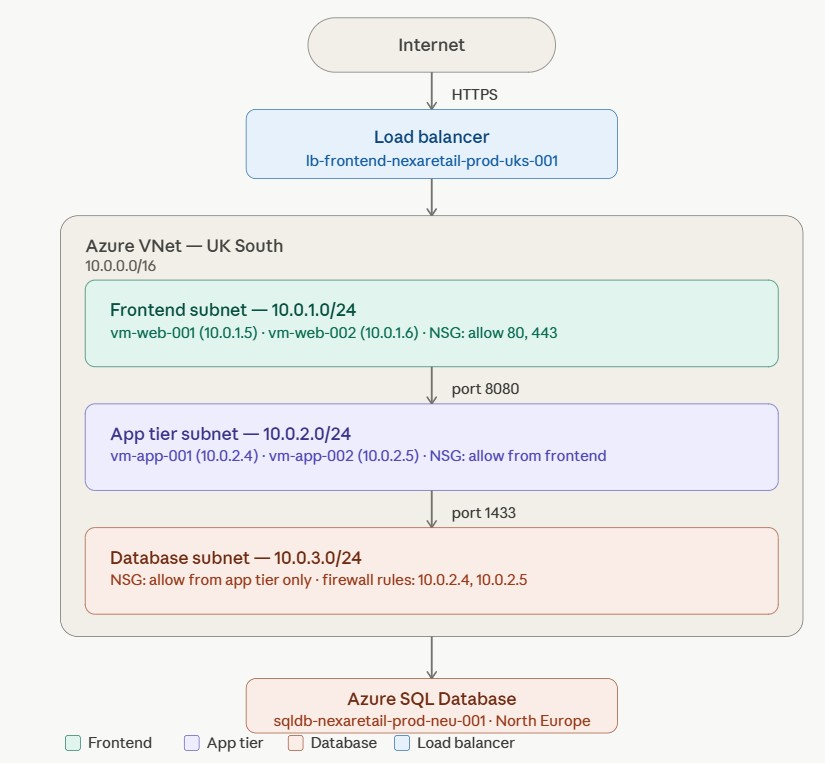
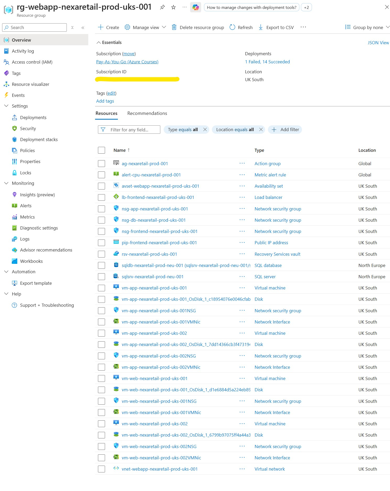
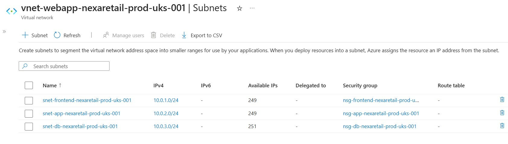
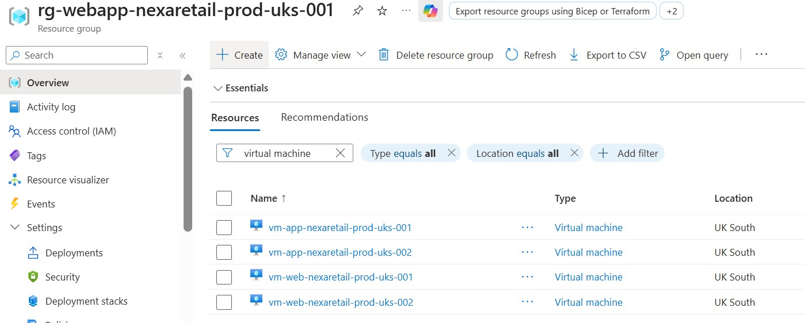
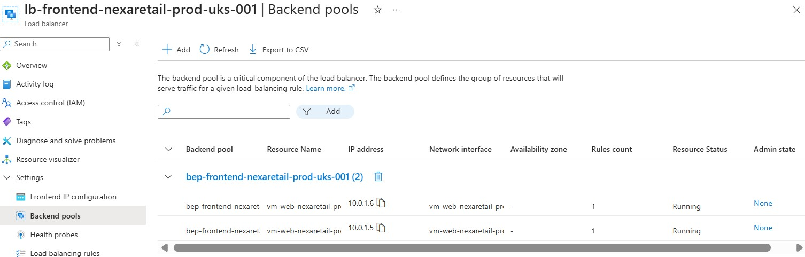
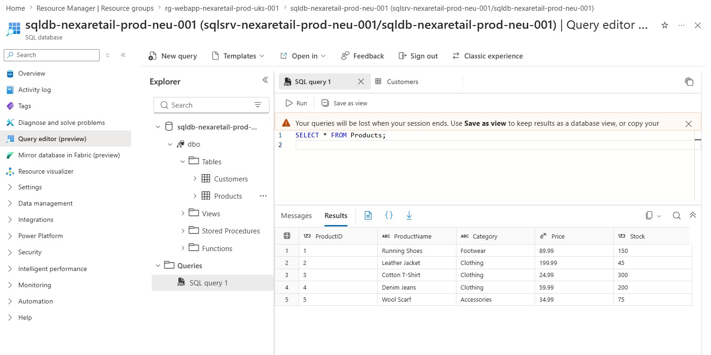
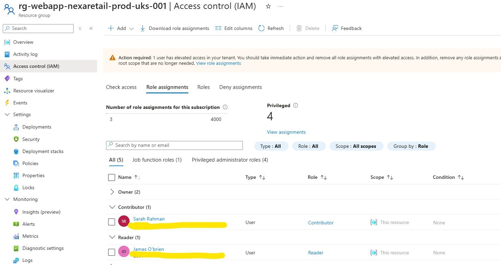
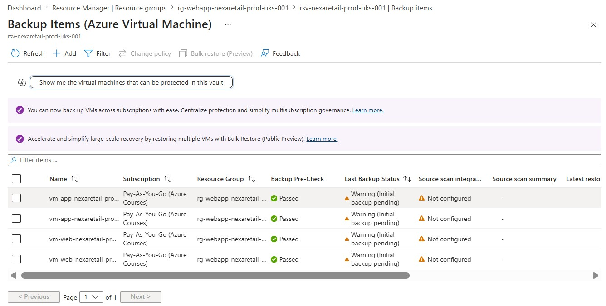
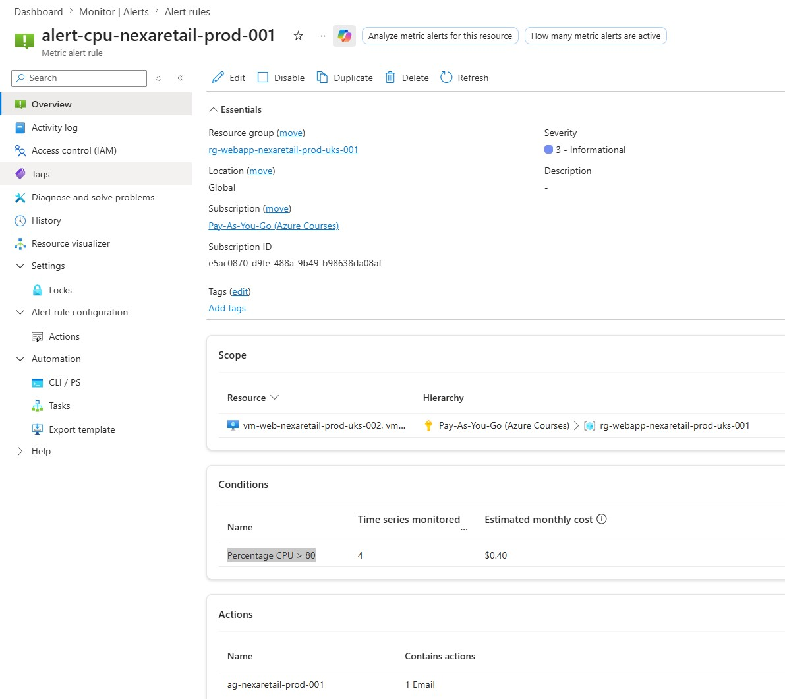

# Azure Three-Tier Web Application Infrastructure

> A production-grade Azure infrastructure project demonstrating AZ-104 system administrator skills, built around a realistic business scenario for a fictional UK e-commerce company — NexaRetail Ltd.

---

## Business Scenario

**Company:** NexaRetail Ltd — a mid-size UK e-commerce and retail company based in Manchester with 320 employees and approximately £42M annual revenue.

**Problem:** NexaRetail's on-premises servers were regularly crashing during peak traffic periods (Black Friday, Boxing Day), costing the business approximately £30,000 per outage in lost sales. There was no centralised identity management, no reliable backup, and zero visibility into infrastructure health or spend.

**My Role:** Azure Administrator — sole cloud engineer, responsible for designing and deploying a secure, scalable, production-ready three-tier cloud infrastructure.

---

## Network Architecture



The solution is a three-tier web application architecture deployed in Azure UK South, with the database hosted in North Europe due to free tier regional availability.

```
Internet
                   │
                   ▼
Public IP (pip-frontend-nexaretail-prod-uks-001)
                   │
                   ▼
Load Balancer (lb-frontend-nexaretail-prod-uks-001)
                   │
                   ▼
┌─────────────────────────────────────────┐
│  VNet: vnet-webapp-nexaretail-prod-uks  │
│  Address Space: 10.0.0.0/16             │
│                                         │
│  ┌─────────────────────────────────┐    │
│  │ Frontend Subnet: 10.0.1.0/24    │    │
│  │ NSG: allow ports 80, 443        │    │
│  │ vm-web-001 (10.0.1.5)           │    │
│  │ vm-web-002 (10.0.1.6)           │    │
│  └──────────────┬──────────────────┘   -│
│                 │ Port 8080             │
│  ┌──────────────▼──────────────────┐    │
│  │ App Tier Subnet: 10.0.2.0/24    │    │
│  │ NSG: allow from frontend only   │    │
│  │ vm-app-001 (10.0.2.4)           │    │
│  │ vm-app-002 (10.0.2.5)           │    │
│  └──────────────┬──────────────────┘    │
│                 │ Port 1433             │
│  ┌──────────────▼──────────────────┐    │
│  │ Database Subnet: 10.0.3.0/24    │    │
│  │ NSG: allow from app tier only   │    │
│  └─────────────────────────────────┘    │
└─────────────────────────────────────────┘
                  │
                  ▼
Azure SQL Database (North Europe)
sqldb-nexaretail-prod-neu-001
```

---

## Screenshots

### 1. Complete Resource Group

> All deployed resources inside `rg-webapp-nexaretail-prod-uks-001` — UK South

---

### 2. Virtual Network — Subnets with NSGs Attached

> Three subnets with correct IP ranges (10.0.1.0/24, 10.0.2.0/24, 10.0.3.0/24) and NSGs attached — 251 usable IPs per subnet

---

### 3. Virtual Machines — All 4 Running

> Two frontend VMs (10.0.1.5, 10.0.1.6) and two app tier VMs (10.0.2.4, 10.0.2.5) running in UK South

---

### 4. Load Balancer — Backend Pool

> Standard public load balancer with both frontend VMs registered in the backend pool

---

### 5. Azure SQL Database — Query Results

> Free tier Azure SQL database with live NexaRetail product and customer data

---

### 6. Entra ID — RBAC Role Assignments

> Sarah Rahman assigned Contributor role, James O'Brien assigned Reader role — principle of least privilege enforced

---

### 7. Recovery Services Vault — VM Backup

> All four VMs enrolled in daily automated backup with DefaultPolicy — 30 day retention

---

### 8. Azure Monitor — Alert Rule

> CPU alert rule monitoring all 4 VMs — triggers when average CPU exceeds 80%

---

## Technologies and Azure Services Used

| Service | Purpose |
|---|---|
| Azure Virtual Network | Network isolation and segmentation |
| Network Security Groups | Firewall rules between tiers |
| Azure Load Balancer (Standard) | High availability for frontend VMs |
| Azure Virtual Machines (Windows Server 2022) | Frontend and app tier compute |
| Availability Sets | VM fault domain separation |
| Azure SQL Database (Free tier) | Relational database backend |
| Microsoft Entra ID | Centralised identity management |
| Role-Based Access Control (RBAC) | Least privilege access control |
| Recovery Services Vault | Automated VM backup |
| Azure Monitor | CPU alerting and infrastructure health |
| Azure Cost Management | Budget alerts and spend tracking |

---

## Resources Deployed

### Networking
| Resource | Name | Details |
|---|---|---|
| Resource Group | rg-webapp-nexaretail-prod-uks-001 | UK South |
| Virtual Network | vnet-webapp-nexaretail-prod-uks-001 | 10.0.0.0/16 |
| Frontend Subnet | snet-frontend-nexaretail-prod-uks-001 | 10.0.1.0/24 |
| App Subnet | snet-app-nexaretail-prod-uks-001 | 10.0.2.0/24 |
| Database Subnet | snet-db-nexaretail-prod-uks-001 | 10.0.3.0/24 |
| NSG Frontend | nsg-frontend-nexaretail-prod-uks-001 | Allow 80, 443 inbound |
| NSG App | nsg-app-nexaretail-prod-uks-001 | Allow 8080 from frontend only |
| NSG Database | nsg-db-nexaretail-prod-uks-001 | Allow 1433 from app tier only |

### Compute
| Resource | Name | Details |
|---|---|---|
| Load Balancer | lb-frontend-nexaretail-prod-uks-001 | Standard SKU, Public |
| Public IP | pip-frontend-nexaretail-prod-uks-001 | Static, Zone-redundant |
| Frontend VM 1 | vm-web-nexaretail-prod-uks-001 | 10.0.1.5, Standard_B2s |
| Frontend VM 2 | vm-web-nexaretail-prod-uks-002 | 10.0.1.6, Standard_B2s |
| App VM 1 | vm-app-nexaretail-prod-uks-001 | 10.0.2.4, Standard_B2s |
| App VM 2 | vm-app-nexaretail-prod-uks-002 | 10.0.2.5, Standard_B2s |
| Availability Set | avset-webapp-nexaretail-prod-uks-001 | 2 fault domains |

### Database
| Resource | Name | Details |
|---|---|---|
| SQL Server | sqlsrv-nexaretail-prod-neu-001 | North Europe |
| SQL Database | sqldb-nexaretail-prod-neu-001 | Free tier, Serverless |

### Identity and Security
| Resource | Name | Details |
|---|---|---|
| Entra ID User | sarah.rahman | Contributor role |
| Entra ID User | james.obrien | Reader role |

### Operations
| Resource | Name | Details |
|---|---|---|
| Recovery Services Vault | rsv-nexaretail-prod-uks-001 | Daily VM backup, 30 day retention |
| Budget Alert | budget-nexaretail-prod-001 | Alert at 80% of $800 |
| Monitor Alert Rule | alert-cpu-nexaretail-prod-001 | CPU > 80% on all VMs |

---

## Naming Convention

All resources follow the format: `{type}-{workload}-{environment}-{region}-{instance}`

Example: `vm-web-nexaretail-prod-uks-001`

> **Note:** Windows VM computer names are limited to 15 characters. A shortened computer name was used internally (e.g. `vmwebuks001`) while the full Azure resource name follows the convention above.

---

## Design Decisions and Real-World Notes

### Azure SQL Database vs SQL Managed Instance
For this portfolio project, **Azure SQL Database (Free tier)** was used to minimise cost. In a real production environment, **Azure SQL Managed Instance** would be the preferred choice as it provides full SQL Server compatibility, VNet integration, and enterprise-grade features. SQL Managed Instance costs approximately £150-200/month compared to the free tier used here.

### Database Region (North Europe vs UK South)
Azure SQL Database free tier was not available in UK South at the time of deployment. **North Europe (Ireland)** was selected as the closest available region. In a production environment, all resources would be co-located in UK South to minimise latency. Traffic between UK South VMs and North Europe database travels over Microsoft's private backbone network, not the public internet.

### Lab Domain vs Production Domain
Entra ID users were created under the lab domain `cloudbyq.xyz` (personal Azure tenant). In a production environment, users would be created under the company domain `nexaretail.co.uk` with proper Azure AD Connect synchronisation from on-premises Active Directory.

### Database Connectivity
Due to the cross-region limitation between UK South (VNet) and North Europe (SQL), a VNet service endpoint could not be configured. Instead, SQL firewall rules were used to allow access only from the app tier VM private IP addresses (10.0.2.4 and 10.0.2.5). In production, a Private Endpoint would be used for fully private connectivity.

---

## How to Recreate This Project

### Prerequisites
- Azure subscription (Pay-As-You-Go or free tier)
- Azure CLI installed
- Basic understanding of Azure networking

### Step 1: Create Resource Group and VNet
```bash
az group create \
  --name rg-webapp-nexaretail-prod-uks-001 \
  --location uksouth

az network vnet create \
  --resource-group rg-webapp-nexaretail-prod-uks-001 \
  --name vnet-webapp-nexaretail-prod-uks-001 \
  --address-prefix 10.0.0.0/16 \
  --location uksouth
```

### Step 2: Create Subnets
```bash
az network vnet subnet create \
  --resource-group rg-webapp-nexaretail-prod-uks-001 \
  --vnet-name vnet-webapp-nexaretail-prod-uks-001 \
  --name snet-frontend-nexaretail-prod-uks-001 \
  --address-prefix 10.0.1.0/24

az network vnet subnet create \
  --resource-group rg-webapp-nexaretail-prod-uks-001 \
  --vnet-name vnet-webapp-nexaretail-prod-uks-001 \
  --name snet-app-nexaretail-prod-uks-001 \
  --address-prefix 10.0.2.0/24

az network vnet subnet create \
  --resource-group rg-webapp-nexaretail-prod-uks-001 \
  --vnet-name vnet-webapp-nexaretail-prod-uks-001 \
  --name snet-db-nexaretail-prod-uks-001 \
  --address-prefix 10.0.3.0/24
```

### Step 3: Create and Attach NSGs
```bash
az network nsg create \
  --resource-group rg-webapp-nexaretail-prod-uks-001 \
  --name nsg-frontend-nexaretail-prod-uks-001 \
  --location uksouth

az network nsg create \
  --resource-group rg-webapp-nexaretail-prod-uks-001 \
  --name nsg-app-nexaretail-prod-uks-001 \
  --location uksouth

az network nsg create \
  --resource-group rg-webapp-nexaretail-prod-uks-001 \
  --name nsg-db-nexaretail-prod-uks-001 \
  --location uksouth
```

### Step 4: Deploy Virtual Machines
```bash
az vm create \
  --resource-group rg-webapp-nexaretail-prod-uks-001 \
  --name vm-web-nexaretail-prod-uks-001 \
  --computer-name vmwebuks001 \
  --image Win2022Datacenter \
  --size Standard_B2s \
  --availability-set avset-webapp-nexaretail-prod-uks-001 \
  --vnet-name vnet-webapp-nexaretail-prod-uks-001 \
  --subnet snet-frontend-nexaretail-prod-uks-001 \
  --private-ip-address 10.0.1.5 \
  --public-ip-address "" \
  --admin-username nexaadmin \
  --location uksouth
```

> Repeat for all 4 VMs adjusting name, computer-name, subnet, and private IP accordingly.

---

## Author

**Quentin Durrheim**
- AZ-900 Certified
- AZ-104 Certified

